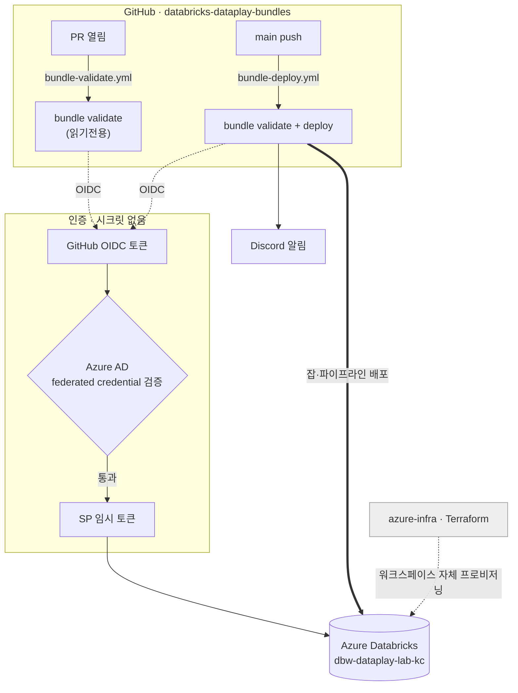

# databricks-dataplay-bundles

Azure Databricks 워크스페이스(`dbw-dataplay-lab-kc`)에 **Databricks Asset Bundle(DAB)** 로 잡·파이프라인을 배포하는 레포. CI/CD는 GitHub Actions, 인증은 **GitHub OIDC → Azure SP → Databricks** (시크릿 없음).

워크스페이스 인프라 자체는 별도 레포 [`azure-infra`](https://github.com/hellojin97/azure-infra)에서 Terraform으로 관리합니다.

---

## 동작 개요



- **PR**: `databricks bundle validate` (읽기전용 검증)
- **main 머지**: `validate` → `deploy` (실제 반영) → Discord 알림
- 인증: azure-infra와 **동일 SP**를 OIDC로 재사용. 자세한 원리 → [docs/reference/azure-sp-oidc-federation.md](docs/reference/azure-sp-oidc-federation.md)

---

## ⚠️ 처음 한 번: Azure 사전 작업 (필수)

이걸 안 하면 CI 첫 실행이 인증 실패합니다. SP에 **이 레포용 federated credential 2개**를 등록해야 합니다.

→ 절차: **[docs/handson/01-azure-prereq.md](docs/handson/01-azure-prereq.md)**

요지: 같은 SP에 subject가 아래인 FC를 추가/갱신.
- `repo:hellojin97/databricks-dataplay-bundles:ref:refs/heads/main`
- `repo:hellojin97/databricks-dataplay-bundles:pull_request`

---

## 문서

- 실습: [handson/01-azure-prereq](docs/handson/01-azure-prereq.md) → [02-bundle-setup](docs/handson/02-bundle-setup.md) → [03-cicd-deploy](docs/handson/03-cicd-deploy.md)
- 개념: [reference/azure-sp-oidc-federation](docs/reference/azure-sp-oidc-federation.md) · [reference/databricks-asset-bundles](docs/reference/databricks-asset-bundles.md)
- 헌법: [.specify/memory/constitution.md](.specify/memory/constitution.md) (v1.0.0)
- 기능 명세 (spec-kit):
  - `001-wikimedia-changes-ingest` — [spec](specs/001-wikimedia-changes-ingest/spec.md) · [plan](specs/001-wikimedia-changes-ingest/plan.md) · [tasks](specs/001-wikimedia-changes-ingest/tasks.md) · [quickstart](specs/001-wikimedia-changes-ingest/quickstart.md)

---

## GitHub 레포 설정값

OIDC라 SP 식별자는 비밀이 아님 → **Variables**. Discord webhook만 **Secret**.
(이유 → [reference §6](docs/reference/azure-sp-oidc-federation.md#6-왜-github-secrets가-아니라-variables인가))

| 종류 | 이름 | 값 출처 |
|---|---|---|
| Variable | `AZURE_CLIENT_ID` | azure-infra와 동일 SP appId |
| Variable | `AZURE_TENANT_ID` | azure-infra와 동일 |
| Variable | `AZURE_SUBSCRIPTION_ID` | azure-infra와 동일 |
| Secret | `DATABRICKS_BUNDLES_DISCORD_WEBHOOK_URL` | Discord webhook (azure-infra 것 재사용 가능) |

```bash
gh variable set AZURE_CLIENT_ID       --body "<appId>"
gh variable set AZURE_TENANT_ID       --body "<tenantId>"
gh variable set AZURE_SUBSCRIPTION_ID --body "<subscriptionId>"
gh secret   set DATABRICKS_BUNDLES_DISCORD_WEBHOOK_URL --body "<webhook-url>"
```

> 워크스페이스 host는 GitHub 설정이 아니라 `databricks.yml`의 `targets.lab.workspace.host` 한 곳에서만 관리합니다(단일 소스).

---

## 로컬 개발

```bash
az login                                  # 개인 계정으로 로컬 인증
databricks bundle validate --target lab   # 구성 검증
databricks bundle deploy   --target lab   # 워크스페이스에 배포
databricks bundle run example_job --target lab   # 잡 실행
```

`lab` target 은 `mode` 를 명시하지 않아 정식 리소스 이름과 활성 스케줄로 배포됩니다 — 본 워크스페이스가 단일 운영 타깃이고 일부 잡(예: `wikimedia_recentchanges`)이 cron 으로 실제 동작해야 하기 때문. 개인 격리가 필요해지면 별도의 `dev` target 을 추가해 `mode: development` 를 거기에 적용하세요.

---

## 워크로드 추가하기

1. 실행 코드를 `src/`에 추가
2. `resources/<name>.yml`에 잡/파이프라인 정의 (`databricks.yml`의 `include`가 자동 포함)
3. PR → validate 통과 확인 → main 머지 시 자동 배포

상세 → [docs/handson/02-bundle-setup.md](docs/handson/02-bundle-setup.md)

---

## 스키마 자동완성 유지보수

`bundle_config_schema.json`은 **Databricks CLI 버전에 종속**(생성 시 `v0.299.2`). CLI 업그레이드 시:

```bash
databricks bundle schema > bundle_config_schema.json
git add bundle_config_schema.json && git commit -m "chore: regenerate bundle schema"
```

VSCode 자동완성은 `redhat.vscode-yaml` 확장 필요.
