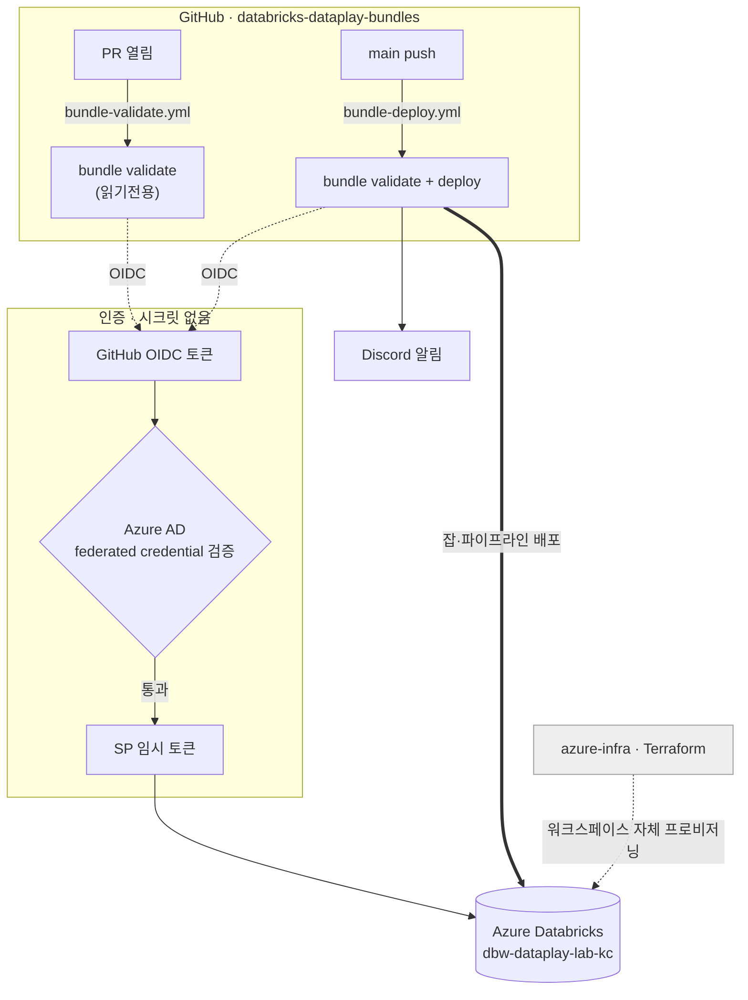

# databricks-dataplay-bundles

**Azure Databricks 위에 굴러가는 데이터 파이프라인을 코드로 정의하고, 사람이 클릭 한 번 없이 배포·운영하는 레포.**

워크스페이스(`dbw-dataplay-lab-kc`) 자체는 [`azure-infra`](https://github.com/hellojin97/azure-infra) 에서 Terraform 으로 만들고, 본 레포는 **그 워크스페이스 안에서 무엇이 돌지** (잡, 카탈로그, 스키마, 볼륨)를 정의·배포한다.

---

## 이 레포가 풀고자 하는 문제

데이터 인프라를 다루다 보면 흔히 만나는 마찰들 — 본 레포는 이걸 의도적으로 코드/규약으로 박아 회피한다.

| 흔한 마찰 | 본 레포의 입장 |
|----------|---------------|
| "그 잡 누가 만들었지? UI 에서 누가 한 번 고쳤더라" | 잡·자산은 **레포 안의 코드(DAB)** 에만 존재. UI 수동 변경은 drift 로 간주. |
| "deploy 토큰을 어디 보관해야 안전할까" | 토큰 없음. **GitHub OIDC → Azure SP → Databricks** federated credential. Secret 0건(웹훅 제외). |
| "스펙은 사라지고 코드만 남는다" | [Spec Kit](.specify/) 흐름으로 spec → plan → tasks → 구현이 모두 레포 안에 산출물로 남는다. 본 PR 의 [001-wikimedia-changes-ingest](specs/001-wikimedia-changes-ingest/) 가 첫 사례. |
| "처음 보는 사람은 어디부터 봐야 하지" | [헌법](.specify/memory/constitution.md) 가 "이 프로젝트에서 결정되어 있는 7가지" 를 명시. PR 리뷰의 1차 잣대. |

---

## 어떤 워크로드가 들어 있나

| ID | 무엇 | 어떻게 |
|----|------|--------|
| `wikimedia_recentchanges` | Wikipedia 영문판의 모든 변경사항을 **5분 주기**로 수집해 `wikimedia-dataplay.bronze.recentchanges_raw` 볼륨에 **원본 그대로(NDJSON+gzip)** 적재 | MediaWiki Action API · Databricks Serverless Python task · cron `*/5` · 멱등(파일 덮어쓰기) |
| `example_job` | 번들 골격이 도는지 확인하는 hello-world | 별도 의도 없음 |

신규 워크로드는 [spec-kit 워크플로](#spec-kit-로-새-기능-만들기) 로 추가한다.

---

## 동작 개요



- **PR**: `bundle validate` 만 (워크스페이스 read-only).
- **main 머지**: `validate` → `deploy` → Discord 알림.
- 인증: azure-infra 와 **동일 SP** 를 OIDC 로 재사용. 원리는 [reference/azure-sp-oidc-federation](docs/reference/azure-sp-oidc-federation.md).

---

## 왜 이렇게 정의했나 — 핵심 결정 7가지

전체 규약은 [헌법](.specify/memory/constitution.md) (v1.0.0) 참조. 의문이 생기면 헌법이 1차 기준.

1. **Bundle-First.** 잡·자산은 `resources/jobs/*` 와 `configuration/*.yml` 의 DAB 정의가 단일 소스. 워크스페이스 UI 수동 변경은 운영 자산으로 간주하지 않는다.
2. **호출부와 비즈니스 로직 분리.** Databricks task 가 가리키는 스크립트는 인자 파싱·의존성 생성·결과 로그만 (≤ 50줄), 데이터 변환·검증은 별도 모듈. 잡 정의 변경과 로직 변경의 리뷰 동선이 자연스럽게 분리된다.
3. **변환은 함수, I/O 는 클래스.** `DataFrame.transform` (또는 일반 함수) 합성으로 변환을 표현하고 외부 호출·파일 쓰기는 클래스로 캡슐화. 외부 입력은 Pydantic, 내부 데이터는 frozen dataclass — 경계가 명확.
4. **SparkSession 은 명시적 인자로만.** 전역 `getOrCreate()` 금지. 단위 테스트가 로컬 SparkSession 을 주입하려면 이게 강제되어야 한다. (현재 첫 워크로드는 워크로드 규모가 작아 Spark 미사용 — Complexity #1.)
5. **테스트 우선 (pytest).** 변환 함수에 단위 테스트 없이 머지 불가. 통합 테스트는 외부 자원 없이 `responses`/`tmp_path` 더블로.
6. **타입 안전성·포맷 일관성.** 100% 타입 힌트, `ruff`+`black`, `uv`+`pyproject.toml` 단일화. `requirements.txt` 이중관리 금지.
7. **한국어 문서·영어 식별자.** 모든 산출 문서(spec/plan/tasks/PR)·주석·docstring 은 한국어, 식별자(함수·클래스·변수·모듈)는 영어. `/speckit-*` 노출 메시지도 한국어.

### 잡 정의는 왜 pydabs (Python) 인가

본 레포의 잡은 YAML 이 아닌 **`databricks-bundles` Python DSL** 로 정의한다 (`resources/jobs/*.py`). 카탈로그·스키마·볼륨처럼 정적인 자산은 YAML 그대로 (`configuration/catalogs.yml`). 이유:

- 조건부·반복적 잡 생성, 환경별 파라미터 합성을 표현하기 쉽다.
- 본 레포의 다른 Python 코드와 같은 toolchain(`ruff`/`black`/타입체크) 으로 검사된다.
- IDE 의 자동완성·타입 hint 가 즉시 동작 — YAML 의 `bundle_config_schema.json` 의존 없이.

### `lab` target 은 왜 `mode: development` 가 아닌가

`mode: development` 는 자산 이름에 `[dev <user>]` prefix 를 붙이고 스케줄을 자동 일시정지한다 — 개인 격리에 좋지만 **운영 cron 이 실제로 돌아야 하는 워크스페이스에는 부적합**. 본 워크스페이스가 단일 운영 타깃이므로 `lab` 은 `mode` 를 비워 정식 이름·활성 스케줄로 배포한다. 개인 실험이 필요해지면 별도의 `dev` target 을 추가해 거기에 `mode: development` 를 적용하는 게 깨끗하다.

### 적재 데이터의 원본 보존 — 왜 bronze · NDJSON · `_SUCCESS`

- **bronze 레이어**: 원본 페이로드를 그대로 보존하는 영역. 다운스트림(silver/gold) 이 어떻게 변하든 bronze 는 같은 자리에 있다.
- **NDJSON + gzip**: 스키마 진화에 강건(필드 추가/제거 견딤), 압축률 우수, Spark/Auto Loader 가 직접 읽음. Parquet 은 스키마 사전 선언이 필요해 bronze 의 의미와 충돌.
- **`_SUCCESS` marker**: Databricks Volume FUSE 의 rename 원자성이 보장되지 않음. 다운스트림이 "이 5분 슬롯이 정말 다 적재됐나" 를 알려면 marker 파일 존재로 판정.

---

## Spec Kit 으로 새 기능 만들기

본 레포의 모든 신규 워크로드는 [Spec Kit](https://github.com/github/spec-kit) 슬래시 명령으로 진행한다. 의도는 **결정의 흔적이 산출물로 남게** 하는 것 — 6개월 뒤 "왜 그렇게 했지" 가 PR description 이 아니라 `specs/...` 안에 있다.

```text
/speckit-specify    # WHAT — 사용자 스토리·요구사항·성공기준
/speckit-clarify    # 모호함을 좁힘 (Q&A 가 spec 에 기록됨)
/speckit-plan       # HOW — 기술 컨텍스트·헌법 게이트·설계 산출물 (research / data-model / contracts / quickstart)
/speckit-tasks      # user story 별 dependency-ordered 작업 분해
/speckit-analyze    # spec ↔ plan ↔ tasks 의 정합·커버리지 검토 (read-only)
/speckit-implement  # 실제 코드/테스트/리소스 생성
```

첫 사례: [`specs/001-wikimedia-changes-ingest/`](specs/001-wikimedia-changes-ingest/) — spec.md, plan.md, tasks.md, research.md, data-model.md, contracts/, quickstart.md 가 모두 같은 폴더 안.

---

## ⚠️ 처음 한 번: Azure 사전 작업 (필수)

이걸 안 하면 CI 첫 실행이 인증 실패한다. SP 에 **이 레포용 federated credential 2개** 를 등록해야 한다.

→ 절차: **[docs/handson/01-azure-prereq.md](docs/handson/01-azure-prereq.md)**

요지: 같은 SP 에 아래 subject 의 FC 를 추가/갱신.
- `repo:hellojin97/databricks-dataplay-bundles:ref:refs/heads/main`
- `repo:hellojin97/databricks-dataplay-bundles:pull_request`

---

## 문서

- 실습: [handson/01-azure-prereq](docs/handson/01-azure-prereq.md) → [02-bundle-setup](docs/handson/02-bundle-setup.md) → [03-cicd-deploy](docs/handson/03-cicd-deploy.md)
- 개념: [reference/azure-sp-oidc-federation](docs/reference/azure-sp-oidc-federation.md) · [reference/databricks-asset-bundles](docs/reference/databricks-asset-bundles.md)
- 헌법: [.specify/memory/constitution.md](.specify/memory/constitution.md) (v1.0.0)
- 기능 명세 (spec-kit):
  - `001-wikimedia-changes-ingest` — [spec](specs/001-wikimedia-changes-ingest/spec.md) · [plan](specs/001-wikimedia-changes-ingest/plan.md) · [tasks](specs/001-wikimedia-changes-ingest/tasks.md) · [quickstart](specs/001-wikimedia-changes-ingest/quickstart.md)

---

## GitHub 레포 설정값

OIDC 라 SP 식별자는 비밀이 아님 → **Variables**. Discord webhook 만 **Secret**.

| 종류 | 이름 | 값 출처 |
|---|---|---|
| Variable | `AZURE_CLIENT_ID` | azure-infra 와 동일 SP appId |
| Variable | `AZURE_TENANT_ID` | azure-infra 와 동일 |
| Variable | `AZURE_SUBSCRIPTION_ID` | azure-infra 와 동일 |
| Secret | `DATABRICKS_BUNDLES_DISCORD_WEBHOOK_URL` | Discord webhook (azure-infra 것 재사용 가능) |

> 워크스페이스 host 는 GitHub 설정이 아니라 `databricks.yml` 의 `targets.lab.workspace.host` 한 곳에서만 관리한다(단일 소스).

설정 명령은 [reference/azure-sp-oidc-federation §왜 Variables 인가](docs/reference/azure-sp-oidc-federation.md#6-왜-github-secrets가-아니라-variables인가) 참조.

---

## 로컬 개발

본 레포의 toolchain 은 모두 `uv` (`pyproject.toml` 단일 소스).

```bash
uv sync                                     # 의존성 + dev 그룹 (pytest/ruff/black/databricks-bundles)
uv run pytest -q                            # 단위 + 통합 테스트
uv run ruff check src tests resources
uv run black --check src tests resources

# 워크스페이스 검증·배포
az login
databricks bundle validate --target lab     # pydabs 평가 + DAB 정합성 검증 (read-only)
databricks bundle deploy   --target lab     # 자산 생성/갱신
databricks bundle run wikimedia_recentchanges --target lab    # 잡 1회 수동 실행
```

---

## 스키마 자동완성 유지보수

`bundle_config_schema.json` 은 **Databricks CLI 버전에 종속** (생성 시 `v0.299.2`). CLI 업그레이드 시:

```bash
databricks bundle schema > bundle_config_schema.json
git add bundle_config_schema.json && git commit -m "chore: regenerate bundle schema"
```

VSCode YAML 자동완성은 `redhat.vscode-yaml` 확장이 필요.
