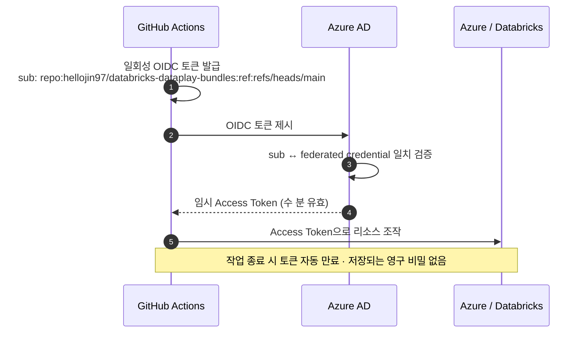
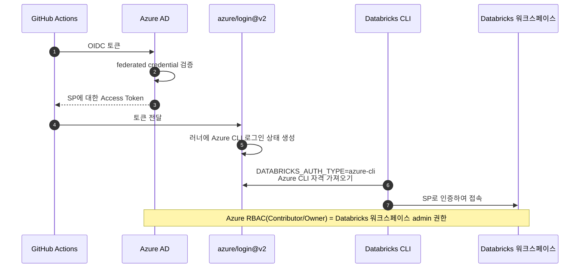

# 레퍼런스: Azure Service Principal · OIDC · Federation 이해하기

이 문서는 "왜 이런 걸 해야 하는가"를 설명합니다. 명령어 실습은 [docs/handson/01-azure-prereq.md](../handson/01-azure-prereq.md)를 보세요.

---

## 한 줄 요약

> GitHub Actions가 **비밀번호 없이** Azure(그리고 그 위의 Databricks)를 조작할 수 있게,
> "이 GitHub 레포에서 온 요청만 믿겠다"는 신뢰 관계를 미리 맺어두는 작업입니다.

---

## 1. 등장인물 정리

| 용어 | 한 줄 설명 | 비유 |
|---|---|---|
| **App Registration** | Azure AD(엔트라 ID)에 "이런 앱이 있다"고 등록한 명세 | 사업자 등록증 |
| **Service Principal (SP)** | 그 앱이 실제로 권한을 행사하는 **계정 주체** | 등록증으로 발급된 실제 직원증 |
| **Client ID (= appId)** | App Registration의 전 세계 고유 ID | 직원증 번호 |
| **Object ID** | SP가 테넌트 안에서 갖는 내부 ID | 인사 시스템상의 사번 |
| **Role Assignment** | "이 SP가 이 범위에서 이 역할을 해도 된다"는 권한 부여 | 출입증에 부여된 출입 가능 구역 |
| **OIDC** | 시크릿 없이 신원을 증명하는 표준 프로토콜 | 지문 인식 출입 |
| **Federated Credential** | "이 GitHub 레포의 이 상황에서 온 토큰만 신뢰" 규칙 | 지문 등록부 |

> ⚠️ **Client ID와 Object ID는 다른 값입니다.** 헷갈리면 거의 모든 명령이 실패합니다.
> - `Client ID(appId)` → 사람이 보통 "SP ID"라 부르는 그 값. GitHub 변수에 넣음.
> - `Object ID` → federated credential을 붙일 때 `--id`에 넣는 값.

---

## 2. 왜 Service Principal이 필요한가

GitHub Actions는 GitHub 서버에서 도는 자동화 봇입니다. 이 봇이 Azure 리소스(Databricks 등)를 만지려면 **Azure가 인정하는 신원**이 있어야 합니다.

사람 계정(본인 Azure 로그인)을 쓰면 안 되는 이유:

- 사람 계정엔 MFA가 걸려 있어 자동화가 불가능
- 퇴사/비번 변경 시 파이프라인이 통째로 멈춤
- "사람"과 "자동화"의 권한·감사 로그가 섞임

그래서 **자동화 전용 로봇 계정 = Service Principal**을 따로 만들고, 거기에 딱 필요한 권한만 줍니다.

---

## 3. 왜 OIDC인가 (시크릿을 안 쓰는 이유)

SP에 인증하는 고전적인 방법은 **client secret**(비밀번호)입니다. 이걸 GitHub Secrets에 저장해두고 쓰는 거죠. 문제는:

- 비밀번호가 GitHub에 평생 저장됨 → 유출되면 그대로 침해
- 만료 주기마다 사람이 수동 회전(rotate)해야 함
- 로그/스크린샷에 실수로 찍히면 끝

**OIDC(OpenID Connect)** 는 비밀번호 자체를 없앱니다. 작동 원리:

핵심: **저장된 비밀번호가 어디에도 없습니다.** 매 실행마다 GitHub이 새 토큰을 발급하고, Azure가 그때그때 검증해서 임시 통행증만 내줍니다. 유출될 영구 비밀이 존재하지 않으니 회전도 필요 없습니다.

---

## 4. Federated Credential — 신뢰의 핵심

OIDC 토큰만 있으면 누구나 Azure에 들어올 수 있으면 안 됩니다. 그래서 SP에 **"어떤 토큰을 믿을지" 화이트리스트**를 등록하는데, 이게 federated credential입니다.

federated credential 한 건은 3가지로 구성됩니다:

| 필드 | 값 | 의미 |
|---|---|---|
| `issuer` | `https://token.actions.githubusercontent.com` | "GitHub Actions가 발급한 토큰만" (항상 고정) |
| `audiences` | `["api://AzureADTokenExchange"]` | Azure AD 토큰 교환용 대상 (항상 고정) |
| `subject` | `repo:OWNER/REPO:<컨텍스트>` | **여기가 진짜 자물쇠** |

`subject`가 토큰의 `sub` 클레임과 **글자 하나까지 정확히** 일치해야 통과합니다.

자주 쓰는 subject 형태:

| subject | 언제 매칭되나 |
|---|---|
| `repo:OWNER/REPO:ref:refs/heads/main` | 그 레포의 **main 브랜치 push**로 실행될 때 |
| `repo:OWNER/REPO:pull_request` | 그 레포의 **PR 이벤트**로 실행될 때 (브랜치 무관) |
| `repo:OWNER/REPO:environment:prod` | 그 레포의 **`prod` 환경**에서 실행될 때 |

그래서 워크플로우 트리거(PR / main push)마다 **별도의 federated credential**이 필요합니다. 이 레포가 main 배포 + PR 검증 두 가지를 쓰므로 FC도 2개 등록합니다.

> 💡 **왜 좁게 잡아야 하나:** subject를 느슨하게(예: 와일드카드) 두면, 누군가 fork하거나 다른 브랜치에서 워크플로우를 돌려도 인증이 통과해 권한이 새어 나갑니다. "정확히 이 레포의 이 상황만" 신뢰하는 게 보안의 본질입니다.

---

## 5. 이 레포에서 — Azure를 거쳐 Databricks까지

여기서 한 단계 더 들어갑니다. 우리가 만지려는 건 Azure 리소스가 아니라 **Azure Databricks 워크스페이스 안의 잡/파이프라인**입니다. 인증 사슬:

**왜 SP가 Databricks admin이 되는가?**
Azure Databricks는 별도 사용자 관리 없이도, **워크스페이스 리소스에 Azure RBAC `Contributor`/`Owner`를 가진 주체를 자동으로 워크스페이스 admin으로 인정**합니다. 이 레포가 쓰는 SP는 구독 범위 `Owner`/`Contributor`를 갖고 있어 `rg-dataplay-lab-kc`의 워크스페이스까지 상속됩니다. 그래서 Databricks 쪽에 추가 사용자 등록(SCIM) 없이 바로 배포가 됩니다.

> 정리: **Azure RBAC 권한이 곧 Databricks 권한**으로 이어집니다. 별도 Databricks PAT(개인 토큰)을 만들지 않는 이유가 이것입니다.

---

## 6. 왜 GitHub "Secrets"가 아니라 "Variables"인가

OIDC를 쓰면 `client_id`, `tenant_id`, `subscription_id`, 워크스페이스 URL은 **민감 정보가 아닙니다.**

이유: 이 값들을 누가 알아도, federated credential이 "특정 레포의 특정 컨텍스트에서 온 OIDC 토큰"이 없으면 토큰 교환을 거부합니다. 비밀번호가 없으니 ID를 알아도 쓸 수 없습니다.

| | Secrets | Variables |
|---|---|---|
| 로그 노출 | 마스킹됨 | 평문 |
| 다시 조회 | 불가 | 가능 |
| 우리 용도 | Discord webhook 같은 진짜 비밀 | client_id 등 비민감 식별자 |

→ 비민감 식별자는 **Variables**로 두면 디버깅 시 워크플로우 로그에서 값을 바로 확인할 수 있어 편합니다. Discord webhook URL처럼 유출되면 곤란한 것만 **Secrets**로 둡니다.

---

## 7. 자주 막히는 지점 (실전)

| 증상 | 원인 | 해결 |
|---|---|---|
| `AADSTS70021: No matching federated identity record` | 토큰 `sub`와 FC `subject` 불일치 | FC subject가 **정확한 레포명/브랜치/이벤트**인지 확인. 레포 이름을 바꿨다면 FC도 갱신 |
| Client ID로 `federated-credential`이 안 만들어짐 | `--id`에 Object ID가 아닌 Client ID를 넣음 | `az ad app show --id <clientId> --query id -o tsv`로 Object ID 조회 후 사용 |
| Databricks 인증은 됐는데 권한 부족 | SP가 워크스페이스 admin이 아님 | SP의 Azure RBAC 확인(`Contributor`/`Owner`), 없으면 부여 |
| `id-token` 권한 오류 | 워크플로우에 `permissions: id-token: write` 누락 | 워크플로우 job에 권한 명시 |

> 🔥 **가장 흔한 사고:** 레포 이름을 바꾸면 `subject`의 `repo:OWNER/REPO` 부분이 어긋나 인증이 전부 깨집니다. 이때는 FC를 삭제하지 말고 `az ad app federated-credential update`로 subject만 새 이름으로 고치면 됩니다.

---

## 더 읽기

- 실습 절차: [docs/handson/01-azure-prereq.md](../handson/01-azure-prereq.md)
- GitHub OIDC 공식 문서: <https://docs.github.com/en/actions/deployment/security-hardening-your-deployments/about-security-hardening-with-openid-connect>
- Azure workload identity federation: <https://learn.microsoft.com/azure/active-directory/workload-identities/workload-identity-federation>
