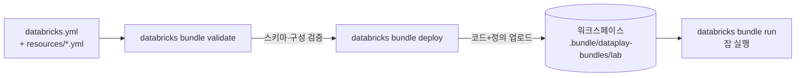

# 레퍼런스: Databricks Asset Bundle (DAB) 이해하기

이 문서는 "DAB가 뭐고 왜 이렇게 구성했는가"를 설명합니다. 실습은 [handson/02-bundle-setup.md](../handson/02-bundle-setup.md), [handson/03-cicd-deploy.md](../handson/03-cicd-deploy.md).

---

## 한 줄 요약

> Databricks **워크스페이스 안의 것**(잡·파이프라인·노트북)을 YAML로 선언하고
> `databricks bundle deploy` 한 방으로 환경별로 배포하는 도구.

---

## 1. Terraform과의 역할 분담

이 프로젝트는 두 레포로 나뉩니다. 경계가 헷갈리기 쉬워 명확히:

| | `azure-infra` (Terraform) | `databricks-dataplay-bundles` (DAB) |
|---|---|---|
| 관리 대상 | 워크스페이스 **자체**, RG, Key Vault 등 Azure 리소스 | 워크스페이스 **안**의 잡·파이프라인·노트북 |
| 도구 | Terraform | Databricks CLI (bundle) |
| 비유 | 건물을 짓는다 | 건물 안에 가구를 배치한다 |

> 워크스페이스를 만드는 것과, 그 안에서 도는 잡을 정의하는 것은 **다른 생명주기**입니다. 그래서 도구와 레포를 분리합니다.

---

## 2. 번들 구성요소

`databricks.yml`이 번들의 루트입니다.

```yaml
bundle:
  name: dataplay-bundles        # 배포 경로·리소스 prefix의 기준
include:
  - resources/*.yml             # 리소스 정의를 쪼개서 자동 포함
  - resources/**/*.yml
targets:
  lab:                          # 배포 대상(환경)
    mode: development
    default: true
    workspace:
      host: https://adb-....azuredatabricks.net/
```

| 개념 | 설명 |
|---|---|
| **bundle** | 번들의 이름·메타. 배포 산출물 경로(`/Workspace/Users/<주체>/.bundle/<name>/<target>`)에 쓰임 |
| **include** | 리소스를 `resources/`로 분리해 관리. glob으로 자동 수집 |
| **resources** | 실제 배포물: `jobs`, `pipelines`, `experiments` 등 |
| **targets** | 배포 환경. 같은 코드를 dev/prod 등에 다르게 배포할 때 타깃별로 override |

이 레포는 단일 타깃 `lab`만 둡니다. 나중에 prod가 필요하면 `targets.prod`를 추가하고 워크플로우에서 `--target prod`로 분기하면 됩니다.

---

## 3. `mode: development`가 하는 일

타깃의 `mode`는 배포 동작을 바꾸는 안전장치입니다.

| | `mode: development` | `mode: production` |
|---|---|---|
| 리소스 이름 | `[dev <user>]` prefix 자동 | 원래 이름 그대로 |
| 스케줄·트리거 | 자동 일시정지(pause) | 그대로 활성 |
| 배포 경로 | 사용자별 격리 경로 | 공유 경로 |
| 용도 | 실험·CI 검증 | 실제 운영 |

이 레포가 `development`인 이유: 단일 lab 환경에서 **실수로 운영처럼 도는 것을 막기 위해서**. 예제 잡이 배포돼도 스케줄이 자동 멈춰 있어 안전합니다. 실제 운영 전환 시 별도 prod 타깃을 `mode: production`으로 추가하는 게 정석입니다.

---

## 4. 배포 흐름



- **validate**: 인증·실행 없이 구성/스키마만 검사 (CI의 PR 단계)
- **deploy**: `src/` 코드와 리소스 정의를 워크스페이스에 업로드하고 잡/파이프라인을 생성·갱신
- **run**: 배포된 잡을 즉시 실행 (검증·수동 실행용)

---

## 5. 잡 컴퓨트: 서버리스 vs 클러스터

`resources/example_job.yml`은 서버리스를 씁니다:

```yaml
environments:
  - environment_key: default
    spec:
      environment_version: "1"
tasks:
  - task_key: hello
    spark_python_task: { python_file: ../src/example.py }
    environment_key: default
```

| 방식 | 장점 | 주의 |
|---|---|---|
| **서버리스** (`environments`) | 클러스터 스펙 불필요, 가장 단순, 빠른 기동 | 워크스페이스에 서버리스가 **활성화돼 있어야 run 성공** |
| **클러스터** (`job_clusters`) | 세밀한 제어(노드·Spark 버전) | 스펙 작성 필요, 기동 느림 |

`databricks bundle validate`는 서버리스 가용 여부와 무관하게 통과합니다. 실제 가용성은 `databricks bundle run`에서 판명됩니다.

---

## 6. 자주 막히는 지점

| 증상 | 원인 | 해결 |
|---|---|---|
| validate는 OK인데 run 실패 | 워크스페이스 서버리스 비활성 | `job_clusters`로 전환하거나 워크스페이스에서 서버리스 활성화 |
| 자동완성/검증이 옛 스키마 기준 | CLI 업그레이드 후 스키마 미갱신 | `databricks bundle schema > bundle_config_schema.json` 재생성·재커밋 |
| `include` 글롭이 아무것도 안 잡음 | `resources/`에 `.yml` 없음 | 리소스 파일 추가(빈 번들은 에러는 아니나 배포물 없음) |
| 배포 경로가 사람마다 다름 | `mode: development`의 사용자별 격리 | 정상 동작. 공유가 필요하면 prod 타깃·production 모드 |

---

## 더 읽기

- 번들 골격 실습: [handson/02-bundle-setup.md](../handson/02-bundle-setup.md)
- CI/CD 실습: [handson/03-cicd-deploy.md](../handson/03-cicd-deploy.md)
- 인증 원리: [reference/azure-sp-oidc-federation.md](azure-sp-oidc-federation.md)
- 공식 문서: <https://docs.databricks.com/dev-tools/bundles/index.html>
